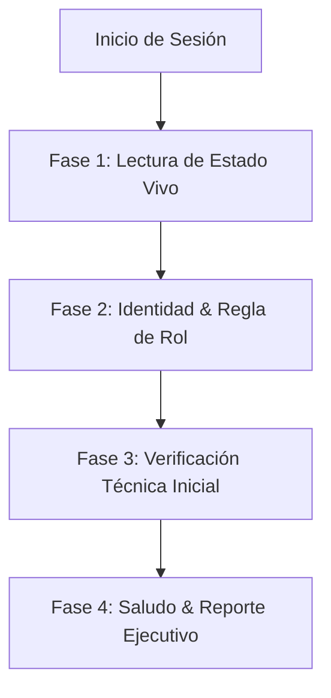

# 🚀 Skill: Session Onboarding & Puesta al Día del Agente

> **Punto de entrada obligatorio al inicio de CUALQUIER sesión de trabajo** para cualquiera de los 4 roles (Fabricador General, Bibliotecario, Inquisidor Primus, Revisor / Magus Logis), en cualquier entorno o arnés de IA (Claude Code, Antigravity, ChatGPT/Codex, DeepSeek).

Esta skill garantiza que ningún agente empiece a trabajar "a ciegas" o con memoria desactualizada, alineando su contexto con el estado vivo del repositorio.

---

## 📋 Secuencia de Ejecución Obligatoria (4 Fases)



---

### Fase 1: Asimilación del Estado Vivo (Las 4 Fuentes de Verdad)

El agente **DEBE leer** (usando las herramientas de lectura de archivos correspondientes) los siguientes 4 archivos ubicados en `herramientas/md/`:

1. **`herramientas/md/DONE.md` (Lectura del encabezado / últimas tareas):**
   - Leer las primeras ~50-80 líneas (lo más reciente arriba).
   - *Objetivo:* Entender qué se completó en la última sesión, qué decisiones de arquitectura o diseño se tomaron y qué agente/herramienta lo ejecutó.

2. **`herramientas/md/PENDING.md` (Lectura del Backlog de Prioridades):**
   - Leer las secciones 🔴 Alta, 🟡 Media y 🟢 Baja.
   - *Objetivo:* Conocer qué tareas están pendientes, cuáles están marcadas como `[En progreso]` y qué archivos tienen `(Locks: <archivo>)` activos para no pisar el trabajo de otros agentes.

3. **`herramientas/md/IDEAS.md` (Lectura del Banco de Conceptos):**
   - Revisar las propuestas e ideas en pausa.
   - *Objetivo:* Evitar proponer o rediseñar desde cero sistemas que ya tienen un concepto o arquitectura preliminar esbozada.

4. **`herramientas/md/Auditoria-Seguridad.md` (Lectura de Hallazgos y Deuda Técnica):**
   - Leer el bloque de auditoría más reciente en la parte superior (sección `🔴 Pendiente`).
   - *Objetivo:* Conocer los vectores de seguridad abiertos, bugs de Firestore o deuda de componentización detectados por el Magus Logis.

---

### Fase 2: Identidad y Regla Sagrada de Rol

1. **Determinar el Rol asignado para la sesión:**
   - ⚙️ **Fabricador General** (Único con permiso de modificar código React/TS/Firebase).
   - 📜 **Bibliotecario** (Custodio de reglas canónicas, compendios `lib/data/` y tratados `Lore/`).
   - 🎭 **Inquisidor Primus** (Diseñador narrativo de Actos, Contratos, PNJs y ambientación).
   - 🛡️ **Revisor / Magus Logis** (Auditor de seguridad, consistencia de reglas, código y tracking).

2. **Leer la regla dedicada correspondiente:**
   - `.agents/rules/fabricador_general.md`
   - `.agents/rules/bibliotecario.md`
   - `.agents/rules/inquisidor_primus.md`
   - `.agents/rules/revisor.md`

3. **Respetar las fronteras de ámbito (Regla de Oro §2 de `AGENTS.md`):**
   - Ningún rol que no sea el Fabricador General toca código fuente ni archivos de Firebase.
   - Si otro rol propone un cambio de código, pasa por el *Gate de Aprobación* del usuario (§1.3).

---

### Fase 3: Verificación Técnica Inicial

1. **Comprobar Git:**
   - Ejecutar `git status` para verificar si hay cambios sin commitear en el working tree o colisiones pendientes.
2. **Comprobar Tipos (Solo Fabricador General):**
   - Ejecutar `npx tsc --noEmit` para verificar que la base de código compile con **0 errores** antes de realizar ninguna modificación.

---

### Fase 4: Reporte Ejecutivo al Usuario

Una vez completada la asimilación, el agente debe responder al usuario con un saludo inmersivo en su tono de rol y un **resumen ejecutivo de 3 puntos**:

```markdown
### ⚙️ [Nombre del Rol] — Puesta al Día Completada

1. 📍 **Contexto Inmediato:** [Resumen de 1 línea de la última tarea cerrada en DONE.md]
2. 🎯 **Estado del Backlog:** [2-3 tareas prioritarias abiertas relevantes para este rol según PENDING.md / Auditoria-Seguridad.md]
3. 🔒 **Locks Activos:** [Archivos bloqueados actualmente por otros agentes, o 'Ninguno']

---
¿Qué tarea deseas que abordemos en esta sesión?
```

---

## 🛡️ Reglas Inmutables durante la Sesión
- **Registro inmediato:** Tras cerrar cualquier tarea, actualizar `DONE.md` (arriba), `PENDING.md` (trasladar a Completado) y hacer `git commit` local.
- **Sin comandos destructivos:** Prohibido `git reset --hard`, `git clean`, `rm -rf` o `git commit --amend`.
- **Preservación de planes:** Todo plan técnico debe guardarse con slug descriptivo y fecha en `herramientas/md/plans/PLAN_YYYY-MM-DD_<nombre>.md` (`AGENTS.md` §1.5).
